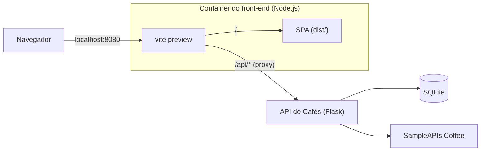
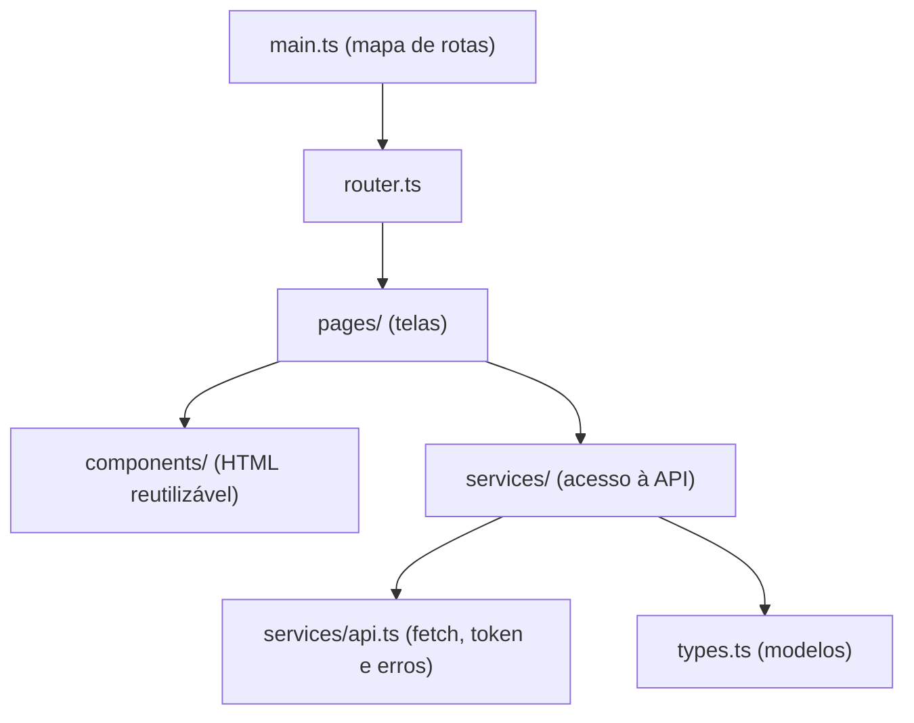

# Front-end - Café Explorer (MVP)

**SPA (Single Page Application)** que apresenta variedades de café consumindo a **API de Cafés** (Flask), com uma **área administrativa** para gerenciar cafés e comentários.

## Tecnologias

| Item | Uso |
| --- | --- |
| HTML + **TypeScript** | Linguagens (sem frameork) |
| **Bootstrap 5** + Bootstrap Icons | Framework de estilização |
| **Vite** | Servidor de desenvolvimento, build e servidor do container |
| **Docker** | Container |

## Funcionalidades

**Área pública**
- Catálogo com busca por nome, ordenação, paginação e opção de incluir cafés externos (SampleAPIs Coffee)
- Detalhe do café com ingredientes, nota média e comentários

**Área administrativa** (login com token JWT)
- Cadastrar, editar e excluir cafés
- Cadastrar, editar e excluir comentários (nota de 1 a 5), com filtro por café

> Cafés externos são somente leitura: não podem ser editados nem receber comentários.

## Arquitetura



**Como a SPA funciona:** o navegador carrega um único `index.html`. A navegação usa o *hash* da URL (`#/cafes/3`, `#/admin/cafes`...). Quando o hash muda, a página não recarrega: o `router.ts` escolhe a tela correspondente e a desenha dentro de `<main id="app">`.

**Por que não há Nginx:** a SPA gerada pelo build é só um conjunto de arquivos estáticos (HTML, JS e CSS). Por usar rotas com hash, ela não precisa de nenhuma regra especial no servidor. Para um MVP, o próprio `vite preview` serve esses arquivos e ainda faz o proxy de `/api` para a API. Isso deixa o container com uma imagem e um estágio só, e dispensa configurar CORS. Em produção real, a troca natural seria servir o `dist/` com Nginx ou uma CDN.

### Camadas



| Arquivo / pasta | Responsabilidade |
|---|---|
| `src/main.ts` | Ponto de entrada: importa estilos e define as rotas |
| `src/router.ts` | Roteador por hash, rotas protegidas e mensagens entre telas |
| `src/types.ts` | Interfaces dos dados da API (`Cafe`, `Comentario`...) e `ApiError` |
| `src/services/` | `api.ts` centraliza as requisições e o token; `auth`, `cafes` e `comentarios` expõem as operações |
| `src/components/` | Navbar, card do café e funções de interface (alertas, estrelas, paginação) |
| `src/pages/` | Uma função por tela |

### Rotas

| Rota | Tela | Acesso |
|---|---|---|
| `#/` | Catálogo | público |
| `#/cafes/:id` | Detalhe de café local | público |
| `#/cafes/externo/:idExterno` | Detalhe de café externo | público |
| `#/admin/login` | Login | público |
| `#/admin/cafes` | Lista de cafés | admin |
| `#/admin/cafes/novo` e `#/admin/cafes/:id/editar` | Formulário de café | admin |
| `#/admin/comentarios` | Lista de comentários | admin |
| `#/admin/comentarios/novo` e `#/admin/comentarios/:id/editar` | Formulário de comentário | admin |

## Como executar

Pré-requisito: a **API de Cafés** em execução (por padrão em `http://127.0.0.1:5000`).

### Com Docker

```bash
docker build -t cafe-frontend .
```

```bash
docker run -d --name cafe-frontend -p 8080:8080 cafe-frontend
```

Acesse **http://localhost:8080**.

Por padrão o container procura a API em `http://host.docker.internal:5000`, ou seja, na máquina hospedeira. Para outro endereço:

```bash
docker run -d --name cafes-front -p 8080:8080 -e API_URL=http://minha-api:5000 cafes-front
```

Observações:
- A API precisa aceitar conexões vindas do container, então o Flask deve escutar em `0.0.0.0` (ex.: `flask run --host=0.0.0.0`).
- No Linux, adicione `--add-host=host.docker.internal:host-gateway` ao `docker run`.

### Sem Docker (Localmente)

Pré-requisito: Node.js 20.19+ ou 22.12+.

```bash
npm install
npm run dev
```

Acesse **http://localhost:5173**.

## Estrutura

```
├── Dockerfile
├── index.html            # página única da SPA
├── vite.config.ts        # proxy /api (dev e preview)
└── src/
    ├── main.ts
    ├── router.ts
    ├── types.ts
    ├── styles.css
    ├── services/         # api.ts, auth.ts, cafes.ts, comentarios.ts
    ├── components/       # navbar.ts, cardCafe.ts, ui.ts
    └── pages/            # catalogo, detalheCafe, login, adminCafes, formCafe,
                          # adminComentarios, formComentario, naoEncontrada
```

## Autor

- Jonathan Greco Leite [@jonathan-greco](https://www.github.com/jonathan-greco)

Repositório do projeto MVP Arquitetura de Software de Pós-graduação de Engenharia de Software, em 2026, da PUC-Rio.
